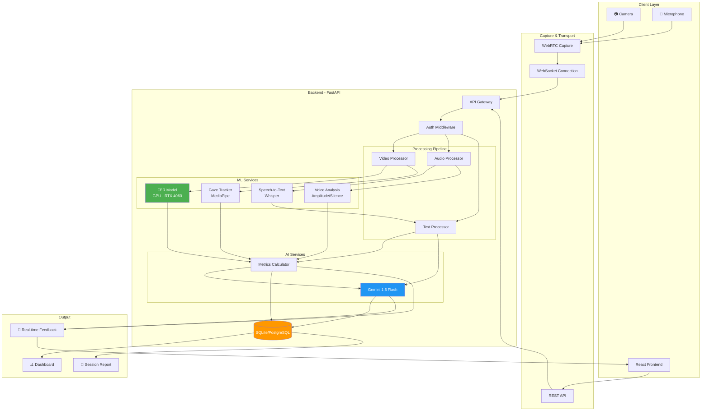
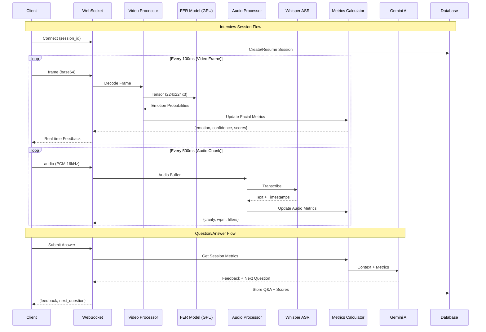
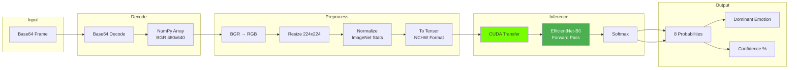
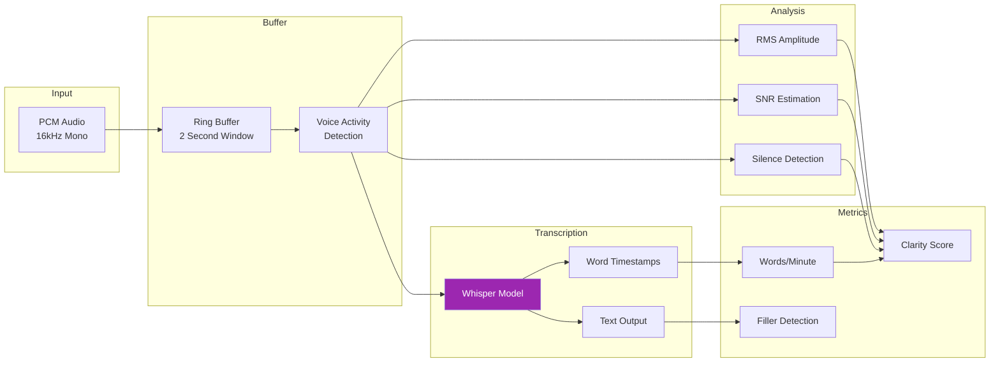
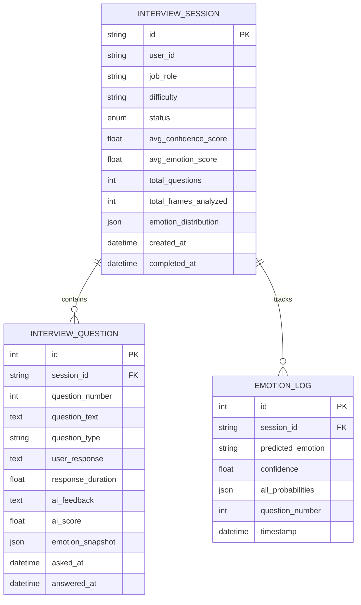

# Smart AI Interview Assistant - System Architecture

**Version:** 1.0
**Last Updated:** January 2025
**Status:** Phase 3 Active Development

---

## Table of Contents

1. [System Overview](#system-overview)
2. [Core Metrics Definition](#core-metrics-definition)
3. [Data Flow Architecture](#data-flow-architecture)
4. [Component Specifications](#component-specifications)
5. [API Contracts](#api-contracts)
6. [Database Schema](#database-schema)
7. [Performance Requirements](#performance-requirements)

---

## System Overview

### Mission Statement

Build a real-time, multimodal AI interview coaching system that analyzes facial expressions, voice patterns, and speech content to provide actionable feedback for interview preparation.

### Architecture Type

**Hybrid Edge-Cloud Architecture**
- **Edge Processing:** Video frame analysis (FER) on local GPU (RTX 4060)
- **Cloud Processing:** Gemini AI for question generation and feedback
- **Real-time Communication:** WebSocket for bidirectional streaming

### Technology Stack

| Layer | Technology | Purpose |
|-------|------------|---------|
| Frontend | React + TypeScript | User interface, WebRTC capture |
| Backend | FastAPI (Python 3.11+) | API gateway, orchestration |
| ML Inference | PyTorch + CUDA 12.1 | FER model on GPU |
| Audio Processing | Whisper / Vosk | Speech-to-text |
| AI Engine | Google Gemini 1.5 | Dynamic Q&A, evaluation |
| Database | SQLite → PostgreSQL | Session persistence |
| Real-time | WebSocket | Frame streaming (<100ms) |

---

## Core Metrics Definition

The system calculates **5 Primary Performance Metrics** that form the Interview Readiness Score (IRS).

### 1. Facial Confidence Score (FCS)

**Definition:** Measures the candidate's perceived confidence based on facial expression analysis.

**Calculation:**
```python
def calculate_facial_confidence(emotion_probabilities: dict, history: list) -> float:
    """
    Calculate facial confidence from FER model output.

    Positive emotions (confidence indicators):
    - happiness: Weight 1.0 (genuine smile indicates confidence)
    - neutral: Weight 0.7 (composed, controlled expression)
    - surprise: Weight 0.3 (can indicate engagement)

    Negative emotions (anxiety indicators):
    - fear: Weight -0.8 (strong anxiety signal)
    - sadness: Weight -0.5 (discomfort)
    - anger: Weight -0.3 (tension)
    - disgust: Weight -0.4 (discomfort)
    - contempt: Weight -0.2 (mild negative)
    """

    WEIGHTS = {
        'happiness': 1.0,
        'neutral': 0.7,
        'surprise': 0.3,
        'fear': -0.8,
        'sadness': -0.5,
        'anger': -0.3,
        'disgust': -0.4,
        'contempt': -0.2
    }

    # Weighted sum of emotion probabilities
    raw_score = sum(
        emotion_probabilities.get(emotion, 0) * weight
        for emotion, weight in WEIGHTS.items()
    )

    # Normalize to 0-100 scale
    # Raw score range: -0.8 to 1.0 → Normalized: 0 to 100
    normalized = ((raw_score + 0.8) / 1.8) * 100

    # Apply temporal smoothing (exponential moving average)
    alpha = 0.3  # Smoothing factor
    if history:
        smoothed = alpha * normalized + (1 - alpha) * history[-1]
    else:
        smoothed = normalized

    return max(0, min(100, smoothed))
```

**Interpretation:**
| Score | Rating | Feedback |
|-------|--------|----------|
| 80-100 | Excellent | Confident and composed presentation |
| 60-79 | Good | Generally positive, minor tension visible |
| 40-59 | Average | Noticeable nervousness, needs practice |
| 20-39 | Below Average | Significant anxiety visible |
| 0-19 | Needs Work | Strong discomfort, recommend relaxation techniques |

---

### 2. Eye Contact Score (ECS)

**Definition:** Measures how consistently the candidate maintains eye contact with the camera (simulating interviewer eye contact).

**Calculation Method:** Using MediaPipe Face Mesh (468 landmarks)

```python
def calculate_eye_contact(face_landmarks: list, frame_width: int, frame_height: int) -> dict:
    """
    Calculate eye contact score using gaze direction estimation.

    Key Landmarks (MediaPipe Face Mesh indices):
    - Left eye: 33, 133, 159, 145 (corners and centers)
    - Right eye: 362, 263, 386, 374
    - Iris centers: 468, 473 (if using iris model)
    - Nose tip: 1 (reference point)

    Method:
    1. Calculate eye center positions
    2. Estimate gaze vector relative to face plane
    3. Measure deviation from camera center
    4. Score based on deviation magnitude
    """

    # Eye landmark indices
    LEFT_EYE_CENTER = 468   # Left iris center
    RIGHT_EYE_CENTER = 473  # Right iris center
    NOSE_TIP = 1

    # Get normalized coordinates
    left_iris = face_landmarks[LEFT_EYE_CENTER]
    right_iris = face_landmarks[RIGHT_EYE_CENTER]
    nose = face_landmarks[NOSE_TIP]

    # Calculate eye center (average of both irises)
    eye_center_x = (left_iris.x + right_iris.x) / 2
    eye_center_y = (left_iris.y + right_iris.y) / 2

    # Calculate deviation from frame center (0.5, 0.5)
    # Normalized coordinates: 0-1 range
    deviation_x = abs(eye_center_x - 0.5)
    deviation_y = abs(eye_center_y - 0.5)

    # Combined deviation (Euclidean distance)
    total_deviation = (deviation_x ** 2 + deviation_y ** 2) ** 0.5

    # Score: 0 deviation = 100, max deviation (0.7) = 0
    MAX_DEVIATION = 0.7
    raw_score = max(0, (1 - total_deviation / MAX_DEVIATION)) * 100

    # Classify gaze direction
    if deviation_x < 0.1 and deviation_y < 0.1:
        gaze_direction = "direct"  # Looking at camera
    elif eye_center_x < 0.4:
        gaze_direction = "left"
    elif eye_center_x > 0.6:
        gaze_direction = "right"
    elif eye_center_y < 0.4:
        gaze_direction = "up"
    else:
        gaze_direction = "down"

    return {
        'score': raw_score,
        'gaze_direction': gaze_direction,
        'deviation': total_deviation,
        'is_looking_at_camera': total_deviation < 0.15
    }


def calculate_eye_contact_stability(history: list[float], window_size: int = 30) -> float:
    """
    Calculate eye contact stability over time.

    Measures consistency of eye contact, not just instantaneous gaze.
    A candidate who maintains steady eye contact scores higher than
    one who frequently looks away.

    Args:
        history: List of recent eye contact scores (last N frames)
        window_size: Number of frames to analyze (30 frames ≈ 1 second at 30fps)

    Returns:
        Stability score 0-100
    """
    if len(history) < window_size:
        return 50.0  # Not enough data

    recent = history[-window_size:]

    # Calculate variance (lower is more stable)
    mean_score = sum(recent) / len(recent)
    variance = sum((x - mean_score) ** 2 for x in recent) / len(recent)
    std_dev = variance ** 0.5

    # Stability score: low variance = high stability
    # Max expected std_dev ≈ 30
    stability = max(0, (1 - std_dev / 30)) * 100

    # Combine average score with stability
    # 70% weight on actual eye contact, 30% on consistency
    combined = 0.7 * mean_score + 0.3 * stability

    return combined
```

**Interpretation:**
| Score | Rating | Feedback |
|-------|--------|----------|
| 80-100 | Excellent | Strong, consistent eye contact |
| 60-79 | Good | Good eye contact with occasional breaks |
| 40-59 | Average | Inconsistent, frequent glances away |
| 20-39 | Below Average | Minimal eye contact, appears distracted |
| 0-19 | Needs Work | Avoiding eye contact, review camera positioning |

---

### 3. Voice Clarity Score (VCS)

**Definition:** Measures speech clarity based on audio signal analysis and transcription quality.

**Calculation:**

```python
import numpy as np
from typing import Tuple

def calculate_voice_clarity(
    audio_chunk: np.ndarray,
    sample_rate: int = 16000,
    transcript: str = ""
) -> dict:
    """
    Calculate voice clarity from audio signal analysis.

    Components:
    1. Signal-to-Noise Ratio (SNR): Measures audio quality
    2. Amplitude Consistency: Detects mumbling vs clear speech
    3. Silence Ratio: Excessive pauses indicate hesitation
    4. Transcription Confidence: ASR model's certainty

    Args:
        audio_chunk: Audio samples (numpy array, mono)
        sample_rate: Audio sample rate (default 16kHz)
        transcript: Optional transcript from ASR

    Returns:
        Dictionary with clarity metrics
    """

    # 1. Calculate RMS amplitude
    rms = np.sqrt(np.mean(audio_chunk ** 2))

    # 2. Detect silence (amplitude below threshold)
    SILENCE_THRESHOLD = 0.01
    silence_frames = np.sum(np.abs(audio_chunk) < SILENCE_THRESHOLD)
    silence_ratio = silence_frames / len(audio_chunk)

    # 3. Calculate amplitude variance (consistency)
    # Split into 50ms windows
    window_size = int(0.05 * sample_rate)
    windows = [
        audio_chunk[i:i+window_size]
        for i in range(0, len(audio_chunk) - window_size, window_size)
    ]

    window_rms = [np.sqrt(np.mean(w ** 2)) for w in windows if len(w) == window_size]

    if window_rms:
        amplitude_variance = np.var(window_rms)
        amplitude_mean = np.mean(window_rms)
        # Coefficient of variation (normalized variance)
        cv = amplitude_variance / (amplitude_mean + 1e-8)
    else:
        cv = 1.0  # High variance (bad)

    # 4. Estimate SNR (simplified)
    # Compare active speech to quiet segments
    sorted_rms = sorted(window_rms) if window_rms else [0]
    noise_floor = np.mean(sorted_rms[:max(1, len(sorted_rms)//10)])
    signal_peak = np.mean(sorted_rms[-max(1, len(sorted_rms)//10):])
    snr_db = 20 * np.log10((signal_peak + 1e-8) / (noise_floor + 1e-8))

    # 5. Score components (0-100 scale)

    # SNR score: 20dB+ is excellent, <5dB is poor
    snr_score = min(100, max(0, (snr_db - 5) / 15 * 100))

    # Silence score: <10% silence is good, >50% is poor
    silence_score = max(0, (1 - silence_ratio / 0.5)) * 100

    # Consistency score: low CV is good
    consistency_score = max(0, (1 - cv / 2)) * 100

    # Combined score
    clarity_score = (
        0.4 * snr_score +
        0.3 * silence_score +
        0.3 * consistency_score
    )

    return {
        'clarity_score': clarity_score,
        'snr_db': snr_db,
        'silence_ratio': silence_ratio,
        'amplitude_consistency': consistency_score,
        'is_speaking': silence_ratio < 0.7,
        'volume_level': 'low' if rms < 0.02 else 'normal' if rms < 0.1 else 'high'
    }


def detect_filler_words(transcript: str) -> dict:
    """
    Detect filler words and hesitations in transcript.

    Common fillers: um, uh, like, you know, basically, actually, so, right
    """
    FILLER_PATTERNS = [
        r'\bum+\b', r'\buh+\b', r'\blike\b', r'\byou know\b',
        r'\bbasically\b', r'\bactually\b', r'\bso\b', r'\bright\b',
        r'\bi mean\b', r'\bkind of\b', r'\bsort of\b'
    ]

    import re

    transcript_lower = transcript.lower()
    word_count = len(transcript.split())

    filler_count = 0
    fillers_found = []

    for pattern in FILLER_PATTERNS:
        matches = re.findall(pattern, transcript_lower)
        filler_count += len(matches)
        fillers_found.extend(matches)

    # Filler ratio (fillers per 100 words)
    filler_ratio = (filler_count / max(1, word_count)) * 100

    # Score: 0 fillers = 100, >10% fillers = 0
    filler_score = max(0, (1 - filler_ratio / 10)) * 100

    return {
        'filler_score': filler_score,
        'filler_count': filler_count,
        'filler_ratio': filler_ratio,
        'fillers_found': fillers_found[:10],  # Top 10
        'word_count': word_count
    }
```

**Interpretation:**
| Score | Rating | Feedback |
|-------|--------|----------|
| 80-100 | Excellent | Clear, well-projected speech |
| 60-79 | Good | Generally clear with minor issues |
| 40-59 | Average | Some mumbling or inconsistent volume |
| 20-39 | Below Average | Difficult to understand, too quiet |
| 0-19 | Needs Work | Severe clarity issues, check microphone |

---

### 4. Emotional Stability Score (ESS)

**Definition:** Measures consistency of emotional state throughout the interview. High variance indicates nervousness; low variance indicates composure.

**Calculation:**

```python
from collections import deque
from typing import List, Dict
import numpy as np

class EmotionalStabilityTracker:
    """
    Track emotional stability over time using a sliding window.

    Stability is measured as the inverse of emotion transition frequency
    and magnitude. A stable candidate maintains consistent emotional
    presentation rather than rapidly shifting between states.
    """

    def __init__(self, window_size: int = 60):
        """
        Args:
            window_size: Number of frames to analyze (60 ≈ 2 seconds at 30fps)
        """
        self.window_size = window_size
        self.emotion_history: deque = deque(maxlen=window_size)
        self.confidence_history: deque = deque(maxlen=window_size)

        # Emotion indices for vectorization
        self.emotions = [
            'neutral', 'happiness', 'surprise', 'sadness',
            'anger', 'disgust', 'fear', 'contempt'
        ]

    def update(self, emotion_probs: Dict[str, float]) -> Dict:
        """
        Update tracker with new emotion prediction.

        Args:
            emotion_probs: Dictionary of emotion -> probability

        Returns:
            Current stability metrics
        """
        # Store as vector
        prob_vector = [emotion_probs.get(e, 0) for e in self.emotions]
        dominant_emotion = self.emotions[np.argmax(prob_vector)]
        confidence = max(prob_vector)

        self.emotion_history.append(prob_vector)
        self.confidence_history.append(confidence)

        return self.calculate_stability()

    def calculate_stability(self) -> Dict:
        """
        Calculate emotional stability metrics.

        Metrics:
        1. Transition Rate: How often dominant emotion changes
        2. Distribution Variance: How spread out emotions are
        3. Confidence Stability: Consistency of prediction confidence
        """
        if len(self.emotion_history) < 10:
            return {
                'stability_score': 50.0,
                'transition_rate': 0,
                'dominant_emotion': 'neutral',
                'confidence_mean': 0.5,
                'status': 'insufficient_data'
            }

        history = list(self.emotion_history)

        # 1. Calculate transition rate
        dominant_emotions = [self.emotions[np.argmax(h)] for h in history]
        transitions = sum(
            1 for i in range(1, len(dominant_emotions))
            if dominant_emotions[i] != dominant_emotions[i-1]
        )
        transition_rate = transitions / (len(dominant_emotions) - 1)

        # Transition score: 0 transitions = 100, >50% transitions = 0
        transition_score = max(0, (1 - transition_rate / 0.5)) * 100

        # 2. Calculate average emotion distribution variance
        # Lower variance = more decisive/confident predictions
        mean_probs = np.mean(history, axis=0)
        distribution_entropy = -np.sum(
            mean_probs * np.log(mean_probs + 1e-8)
        )
        # Normalize entropy (max entropy ≈ 2.08 for 8 classes)
        normalized_entropy = distribution_entropy / 2.08
        distribution_score = (1 - normalized_entropy) * 100

        # 3. Confidence stability
        confidences = list(self.confidence_history)
        confidence_mean = np.mean(confidences)
        confidence_std = np.std(confidences)
        # High mean + low std = stable confident predictions
        confidence_score = confidence_mean * 100 * (1 - min(1, confidence_std / 0.3))

        # Combined stability score
        stability_score = (
            0.4 * transition_score +
            0.3 * distribution_score +
            0.3 * confidence_score
        )

        # Determine dominant emotion (most frequent)
        from collections import Counter
        dominant_emotion = Counter(dominant_emotions).most_common(1)[0][0]

        return {
            'stability_score': stability_score,
            'transition_rate': transition_rate,
            'transition_score': transition_score,
            'distribution_score': distribution_score,
            'confidence_stability': confidence_score,
            'dominant_emotion': dominant_emotion,
            'confidence_mean': confidence_mean,
            'emotion_distribution': {
                e: float(mean_probs[i])
                for i, e in enumerate(self.emotions)
            }
        }
```

**Interpretation:**
| Score | Rating | Feedback |
|-------|--------|----------|
| 80-100 | Excellent | Composed, consistent emotional presentation |
| 60-79 | Good | Generally stable with minor fluctuations |
| 40-59 | Average | Noticeable emotional shifts |
| 20-39 | Below Average | Frequent emotional changes, appears unsettled |
| 0-19 | Needs Work | Highly variable, practice stress management |

---

### 5. Fluency Score (FS)

**Definition:** Measures speech fluency based on words per minute, pause patterns, and sentence structure.

**Calculation:**

```python
import re
from typing import List, Dict, Optional

def calculate_fluency(
    transcript: str,
    duration_seconds: float,
    word_timestamps: Optional[List[Dict]] = None
) -> Dict:
    """
    Calculate speech fluency metrics.

    Components:
    1. Words Per Minute (WPM): Speaking rate
    2. Articulation Rate: WPM excluding pauses
    3. Pause Analysis: Duration and frequency of pauses
    4. Sentence Completeness: Ratio of complete sentences

    Optimal WPM for interviews: 120-150 (conversational pace)

    Args:
        transcript: Full text transcript
        duration_seconds: Total speaking duration
        word_timestamps: Optional list of {word, start, end} for detailed analysis

    Returns:
        Fluency metrics dictionary
    """

    # Clean transcript
    words = transcript.split()
    word_count = len(words)

    # 1. Calculate WPM
    duration_minutes = duration_seconds / 60
    wpm = word_count / max(0.1, duration_minutes)

    # WPM score: optimal range 120-150
    if 120 <= wpm <= 150:
        wpm_score = 100
    elif 100 <= wpm < 120 or 150 < wpm <= 180:
        wpm_score = 80
    elif 80 <= wpm < 100 or 180 < wpm <= 200:
        wpm_score = 60
    else:
        # Too slow (<80) or too fast (>200)
        wpm_score = max(0, 40 - abs(wpm - 135) / 2)

    # 2. Pause analysis (if timestamps available)
    pause_score = 70  # Default
    pause_stats = {}

    if word_timestamps and len(word_timestamps) > 1:
        pauses = []
        for i in range(1, len(word_timestamps)):
            gap = word_timestamps[i]['start'] - word_timestamps[i-1]['end']
            if gap > 0.1:  # Pause > 100ms
                pauses.append(gap)

        if pauses:
            avg_pause = sum(pauses) / len(pauses)
            long_pauses = sum(1 for p in pauses if p > 1.0)  # >1 second

            pause_stats = {
                'count': len(pauses),
                'avg_duration': avg_pause,
                'long_pauses': long_pauses
            }

            # Score pauses: some pauses are good (thoughtful)
            # Too many long pauses indicate hesitation
            pause_score = max(0, 100 - long_pauses * 10 - (avg_pause - 0.3) * 50)

    # 3. Sentence structure analysis
    sentences = re.split(r'[.!?]+', transcript)
    sentences = [s.strip() for s in sentences if s.strip()]

    complete_sentences = sum(
        1 for s in sentences
        if len(s.split()) >= 3  # At least 3 words
    )

    sentence_ratio = complete_sentences / max(1, len(sentences))
    structure_score = sentence_ratio * 100

    # 4. Combined fluency score
    fluency_score = (
        0.4 * wpm_score +
        0.3 * pause_score +
        0.3 * structure_score
    )

    # Determine feedback
    if wpm < 100:
        pace_feedback = "Consider speaking slightly faster to maintain engagement"
    elif wpm > 180:
        pace_feedback = "Try to slow down for better clarity"
    else:
        pace_feedback = "Good speaking pace"

    return {
        'fluency_score': fluency_score,
        'wpm': round(wpm, 1),
        'wpm_score': wpm_score,
        'pause_score': pause_score,
        'structure_score': structure_score,
        'word_count': word_count,
        'sentence_count': len(sentences),
        'pause_stats': pause_stats,
        'pace_feedback': pace_feedback
    }
```

**Interpretation:**
| Score | WPM Range | Rating | Feedback |
|-------|-----------|--------|----------|
| 80-100 | 120-150 | Excellent | Natural, conversational pace |
| 60-79 | 100-120 or 150-180 | Good | Slightly slow/fast but acceptable |
| 40-59 | 80-100 or 180-200 | Average | Pace affects communication |
| 20-39 | 60-80 or 200-220 | Below Average | Significant pace issues |
| 0-19 | <60 or >220 | Needs Work | Pace severely impacts understanding |

---

### Combined Interview Readiness Score (IRS)

```python
def calculate_interview_readiness_score(
    facial_confidence: float,
    eye_contact: float,
    voice_clarity: float,
    emotional_stability: float,
    fluency: float,
    custom_weights: Optional[Dict[str, float]] = None
) -> Dict:
    """
    Calculate the overall Interview Readiness Score.

    Default weights reflect importance in typical interviews:
    - Communication (voice + fluency): 40%
    - Presence (facial + eye contact): 35%
    - Composure (emotional stability): 25%
    """

    DEFAULT_WEIGHTS = {
        'facial_confidence': 0.20,
        'eye_contact': 0.15,
        'voice_clarity': 0.20,
        'emotional_stability': 0.25,
        'fluency': 0.20
    }

    weights = custom_weights or DEFAULT_WEIGHTS

    scores = {
        'facial_confidence': facial_confidence,
        'eye_contact': eye_contact,
        'voice_clarity': voice_clarity,
        'emotional_stability': emotional_stability,
        'fluency': fluency
    }

    # Weighted average
    irs = sum(scores[k] * weights[k] for k in scores)

    # Determine rating
    if irs >= 80:
        rating = "Interview Ready"
        color = "green"
    elif irs >= 60:
        rating = "Good Progress"
        color = "blue"
    elif irs >= 40:
        rating = "Needs Practice"
        color = "yellow"
    else:
        rating = "Focus on Fundamentals"
        color = "red"

    # Find weakest area for targeted feedback
    weakest = min(scores, key=scores.get)
    strongest = max(scores, key=scores.get)

    return {
        'irs': round(irs, 1),
        'rating': rating,
        'color': color,
        'component_scores': scores,
        'weights_used': weights,
        'strongest_area': strongest,
        'weakest_area': weakest,
        'priority_improvement': weakest
    }
```

---

## Data Flow Architecture

### High-Level System Diagram



### Detailed Data Flow Sequence



### Frame Processing Pipeline (Detail)



### Audio Processing Pipeline (Detail)



---

## Component Specifications

### 1. Video Processing Component

| Specification | Value |
|--------------|-------|
| Input Format | Base64 JPEG/PNG |
| Frame Rate | 10-30 FPS (adaptive) |
| Resolution | 480x640 recommended |
| Preprocessing | BGR→RGB, Resize 224x224, ImageNet normalize |
| Model Input | Tensor [1, 3, 224, 224] float32 |
| Inference Device | CUDA (RTX 4060) |
| Target Latency | <50ms per frame |

### 2. Audio Processing Component

| Specification | Value |
|--------------|-------|
| Input Format | PCM Int16 or Float32 |
| Sample Rate | 16000 Hz (Whisper native) |
| Channels | Mono |
| Chunk Size | 500ms (8000 samples) |
| Buffer Size | 2 seconds (rolling) |
| ASR Model | Whisper Small/Medium |
| Target Latency | <200ms transcription |

### 3. ML Models

| Model | Architecture | Parameters | Input | Output | Device |
|-------|-------------|------------|-------|--------|--------|
| FER | EfficientNet-B0 | 5.3M | 224x224x3 | 8 classes | GPU |
| Gaze | MediaPipe Mesh | 4.2M | 192x192x3 | 468 landmarks | CPU |
| ASR | Whisper Small | 244M | 16kHz audio | Text + timestamps | GPU |

---

## Performance Requirements

### Latency Targets

| Operation | Target | Maximum |
|-----------|--------|---------|
| Frame inference (FER) | <30ms | 50ms |
| Gaze estimation | <10ms | 20ms |
| Audio chunk analysis | <50ms | 100ms |
| Transcription (500ms audio) | <200ms | 500ms |
| WebSocket round-trip | <100ms | 200ms |
| Gemini API call | <2s | 5s |

### Throughput

| Metric | Target |
|--------|--------|
| Video frames/second | 30 FPS |
| Audio chunks/second | 2 chunks |
| Concurrent sessions | 1 (GPU limited) |

### Resource Utilization (RTX 4060)

| Resource | Expected Usage |
|----------|---------------|
| GPU Memory | 2-3 GB (FER + Whisper) |
| GPU Compute | 40-60% |
| System RAM | 4-6 GB |
| CPU | 20-30% |

---

## API Contracts

### WebSocket Protocol

**Client → Server:**
```json
{
  "type": "frame",
  "data": "<base64_image>",
  "timestamp": 1706000000000,
  "question_number": 1
}
```

**Server → Client:**
```json
{
  "type": "emotion",
  "data": {
    "emotion": "happiness",
    "confidence": 0.87,
    "probabilities": {
      "neutral": 0.08,
      "happiness": 0.87,
      "surprise": 0.03,
      "sadness": 0.01,
      "anger": 0.00,
      "disgust": 0.00,
      "fear": 0.01,
      "contempt": 0.00
    },
    "metrics": {
      "facial_confidence": 82.5,
      "eye_contact": 78.0,
      "emotional_stability": 85.2
    },
    "inference_ms": 24.5
  }
}
```

---

## Database Schema



---

## Appendix: Environment Variables

```env
# Application
APP_NAME="Smart AI Interview Assistant"
DEBUG=false

# Hardware
INFERENCE_DEVICE=cuda
FER_MODEL_PATH=./models/best_model.pth
FER_MODEL_ARCHITECTURE=efficientnet_b0

# Audio
WHISPER_MODEL=small
AUDIO_SAMPLE_RATE=16000

# AI
GEMINI_API_KEY=<your_key>
GEMINI_MODEL=gemini-1.5-flash

# Database
DATABASE_URL=sqlite+aiosqlite:///./interview.db
```

---

*Document generated for Smart AI Interview Assistant v1.0*
